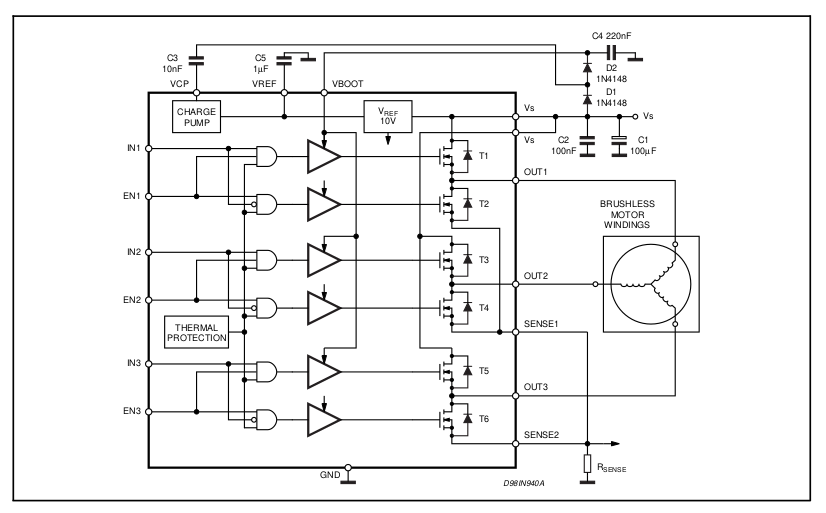

# BLDC Driver
3-phase driver for bldc motor, based on stm32 and l6234.

## L6234 Block Diagram



# Installation

## Install compiler from here

* [GNU ARM Embedded Tool chain for Linux](https://developer.arm.com/tools-and-software/open-source-software/developer-tools/gnu-toolchain/gnu-rm/downloads)

## Install St-link software

```
$ sudo apt-get install automake autoconf pkg-config libusb-1.0 git
$ git clone https://github.com/texane/stlink.git stlink
$ cd stlink
$ ./autogen.sh
$ ./configure
$ make
```
